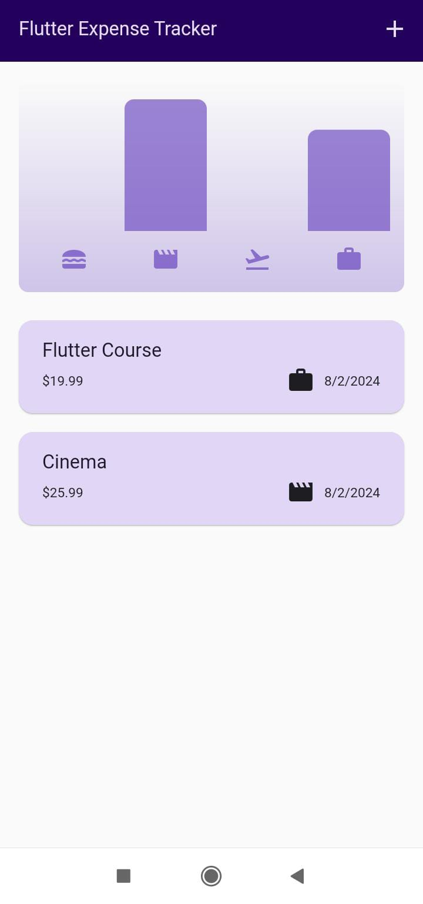
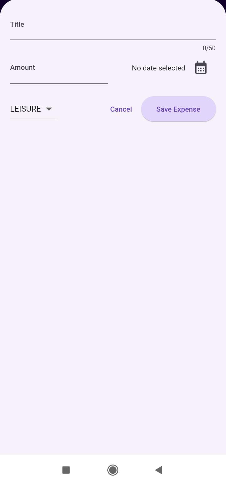
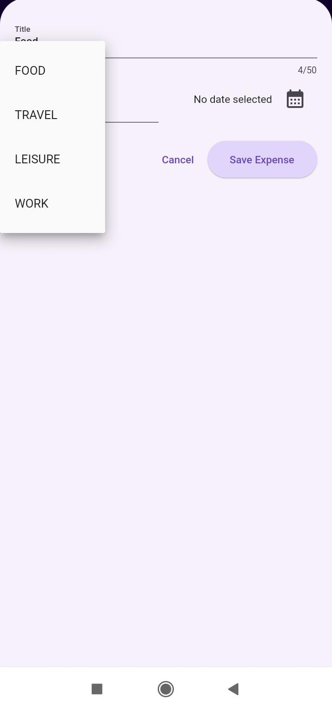
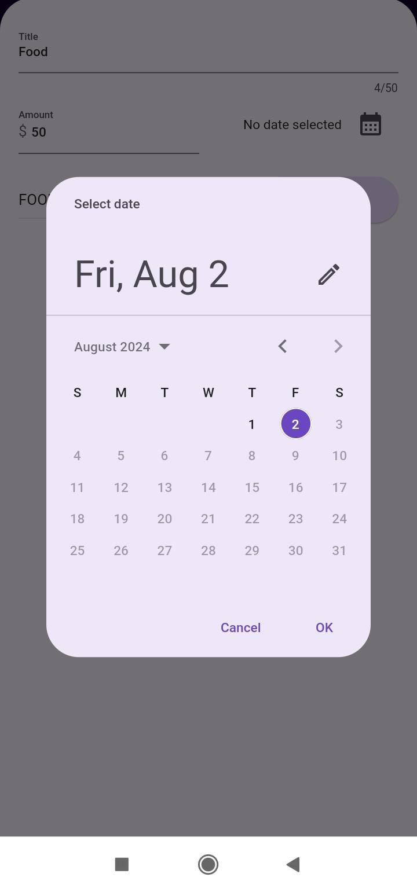
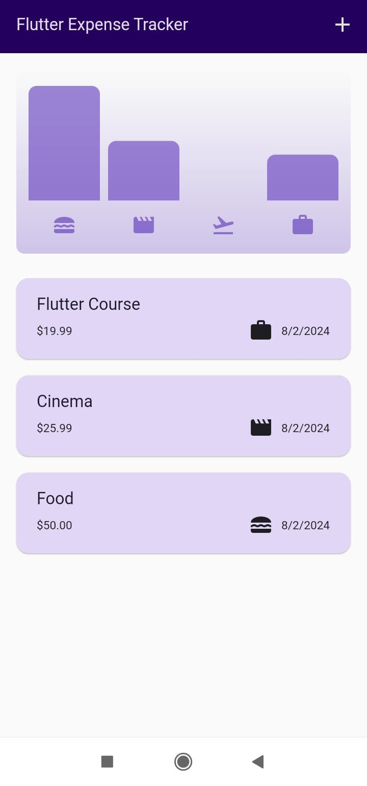

# Expense Tracker App

The Expense Tracker App is a simple and intuitive mobile application built using Flutter. It helps keep track of expenses by categorizing them into different sections such as food, travel, leisure, and work. Expenses can be added with a title, amount, category, and date.

## Features

- Add new expenses with a title, amount, category, and date.
- Categories include food, travel, leisure, and work.
- View a list of all expenses.

## Screenshots

<p >
    
    
  
  
  
</p>


## Getting Started

### Prerequisites

- Flutter SDK: [Install Flutter](https://flutter.dev/docs/get-started/install)
- Dart SDK (included with Flutter)

### Installation

1. Clone the repository:
    ```sh
    git clone https://github.com/aparnaprabhuu/Expense-Tracker-App.git
    ```
2. Navigate to the project directory:
    ```sh
    cd Expense-Tracker-App
    ```
3. Install dependencies:
    ```sh
    flutter pub get
    ```

### Running the App

1. Ensure a device is connected or an emulator is running.
2. Run the app:
    ```sh
    flutter run
    ```
